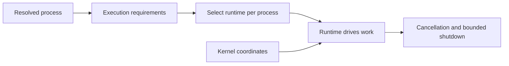

# rustclamp-runtime

Clamp execution-environment contracts, added only when a prototype requires them.

Phase 0 scaffold. There are no public contracts yet. This package builds alone
with Rust 1.96.1 and has no dependencies. Publishing is disabled until licensing,
registry ownership and the first prototype API have been reviewed.

Runtime contracts should let each process select the execution model it needs.
Kernel coordination and runtime execution are separate responsibilities:



| Baseline | Current result |
| --- | --- |
| External Rust dependencies | 0 |
| Public runtime contracts | 0 |
| Executor requirement | None |
| Runtime measurements | Not applicable until behavior exists |

When a driver is implemented, compare it with equivalent direct Rust under the
same workload. Record dependencies, build and binary cost, tasks/threads,
allocations, startup-to-ready time, throughput, and shutdown duration where
relevant. Missing observations are unavailable, never zero.

```sh
cargo fmt --all -- --check
cargo clippy --offline --locked --all-targets --all-features -- -D warnings
cargo test --offline --locked --all-features
RUSTDOCFLAGS="-D warnings" cargo doc --offline --locked --no-deps --all-features
```

For coordinated checkout, architecture checks, measurements, and release policy,
see the [facade contributor guide](https://github.com/rustclamp/rustclamp/blob/main/CONTRIBUTING.md).
The configured remote is `https://github.com/rustclamp/runtime.git`; repository existence
and public visibility were verified during Phase 0.
